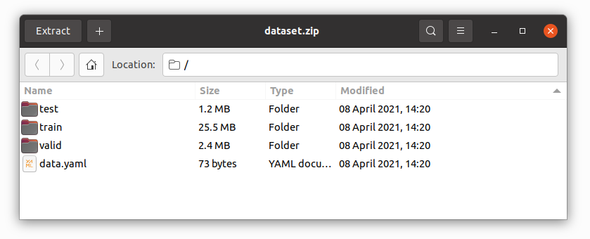
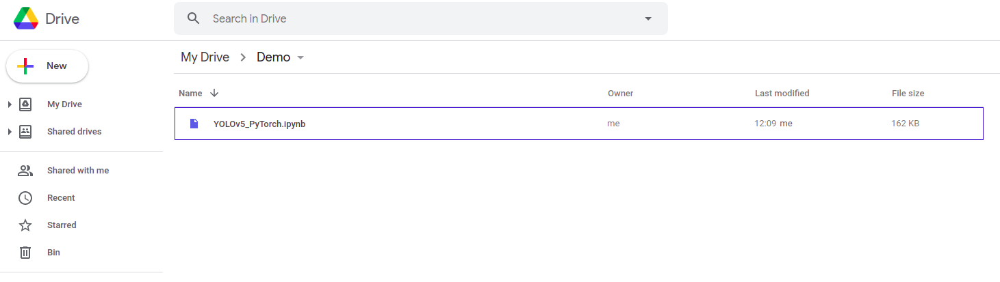
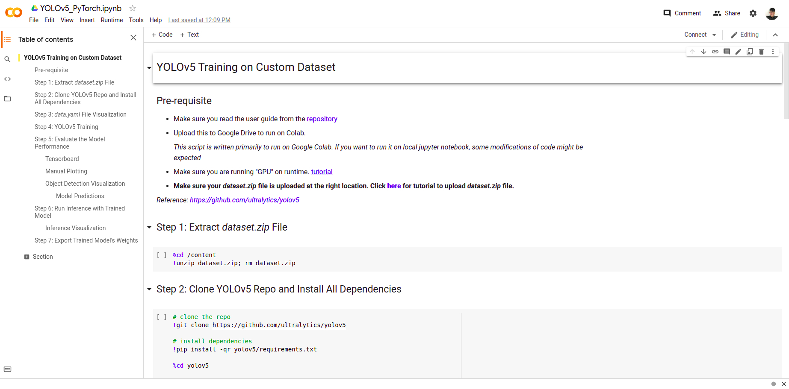
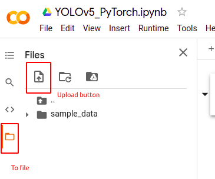
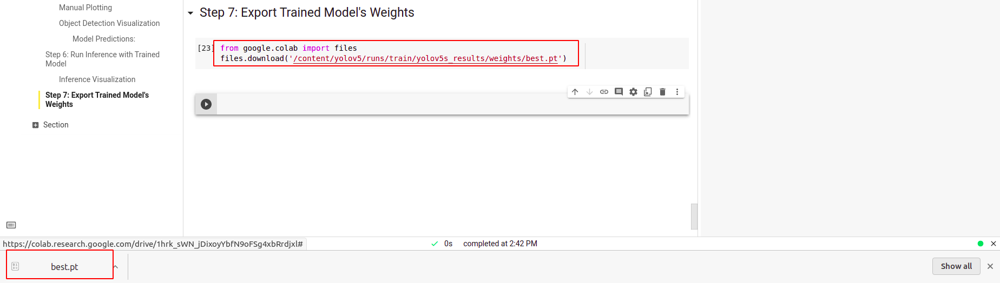
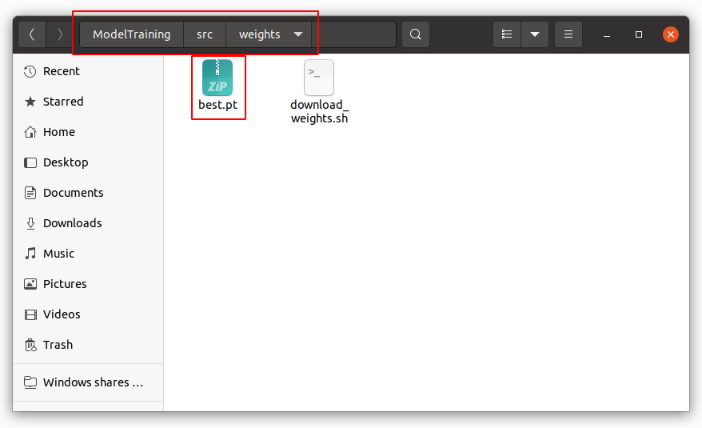
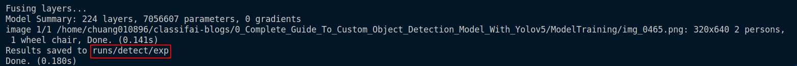
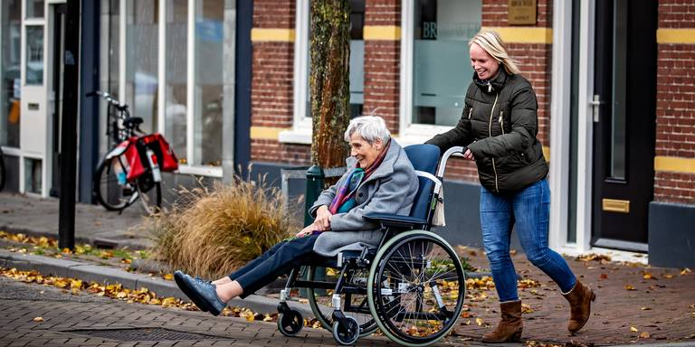
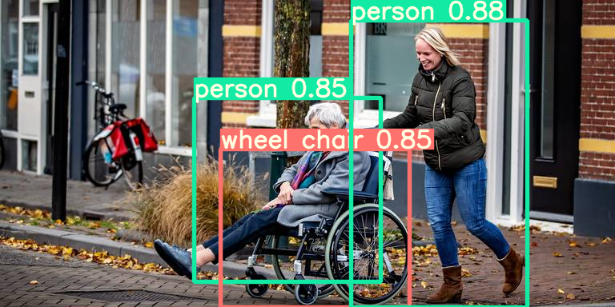

# Model Training

This guide explains how to train your own **custom dataset** with YOLOv5. 

The jupyter notebook script is built to train the YOLOv5 model in **Google Colab**. Certain changes to the script are expected if training is performed locally.

*Reference: https://github.com/ultralytics/yolov5*

---

## User Guide

### Data Preparation
#### Walkthrough Dataset
Click [here](https://www.kaggle.com/yinchuangsum/person-wheel-chair-not-wheel-chair/download) to download the sample dataset for the project walkthrough. 

#### Dataset Structure
The file structure of dataset should be same as the dataset provided:
```
.
+-- dataset
    +-- train
    |   +-- images
    |   |   +-- <<images>>
    |   +-- labels
    |       +-- <<labels>>  
    +-- valid
    |   +-- images
    |   |   +-- <<images>>
    |   +-- labels
    |       +-- <<labels>> 
    +-- test
    |   +-- images
    |   |   +-- <<images>>
    |   +-- labels
    |       +-- <<labels>> 
    +-- data.yaml

```
1. train/valid/test folder
    
    each train/valid/test folder should contains two folders: `images` & `labels` \
    `images` folder contains all the images \
    `labels` folder contains all the label file in *txt format*:\
    *note : data labelled in [ClassifAI](https://github.com/CertifaiAI/classifai) is already in this format. The required step is putting them into the right file structure*
    ```
    label x y w h
    ```

2. data.yaml 

    `data.yaml` is a config file for the model on data path and class names \
    *note : replace the \<\<number of classes>> and \<\<array of class name>>*


    ```
    train: ../train/images
    val: ../valid/images

    nc: <<number of classes>>
    names: [<<array of class names>>]
    ```

*In the project, data augmentation and train-validation-test split is done using [roboflow](https://roboflow.com/). But it is optional to use it, as long as the dataset is following the structure mentioned above.*

### Model training
1. Zip the dataset folder, rename it into `dataset.zip`\
    

2. Upload `YOLOv5_PyTorch.ipynb` jupyter notebook script to google drive\
    

3. Double click to open Google Colab session\
    

4. Go to `files`, upload the `dataset.zip`\
    

5. Run the scripts and follow the instructions written in the jupyter notebook

6. After running all the scripts, the weights are save in your drive. Download it for inference.\
    

---

## Model Inference

### Environment Setup

Activate the conda environment by

    conda activate object-detection

### Inference

#### Weights
For conventions, save the weights of the model into `./src/weights` folder


#### Source of Data
Multiple sources of data are able to be run for inference: 

```
python ./src/detect.py --source 0  # webcam
                                file.jpg  # image 
                                file.mp4  # video
                                path/  # directory
                                path/*.jpg  # glob
                                'https://youtu.be/NUsoVlDFqZg'  # YouTube video
                                'rtsp://example.com/media.mp4'  # RTSP, RTMP, HTTP stream
```

#### Run Inference 
Run the inference script\
*note : replace the variables with << >> to the respective arguments*

```
python ./src/detect.py --source <<source>> --weights <<weights path>> --conf <<threshold>>
```

Eg. 

```
python ./src/detect.py --source img_0007.png --weights ./src/weights/best.pt --conf 0.5
```

---
## Sample Output

### Output Folder
After running the inference script, the output folder to save output data will be stated in the terminal\
In this example below, the output data is saved in `runs/detect/exp`



### Input



### Output

