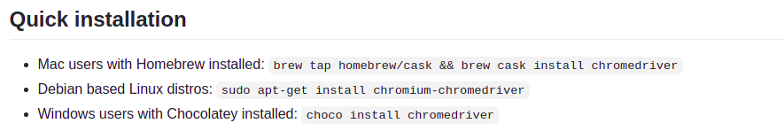

# Complete Guide to Custom Object Detection Model with YOLOv5

*image of wheel chair detection*

In this repository, a complete guide to build a custom object detection model using YOLOv5 will be conducted.

Go to medium post for more details explanation.

---

## Scripts
- WebScraping
    
    Script to scrape data from Google using Selenium

- ModelTraining

    GoogleColab Script to train YOLOv5 model

---

## Getting Started
- ### Install Anaconda
    Download and install [Anaconda](https://www.anaconda.com/products/individual) to create virtual environment

- ### Install ChromeDriver
    Install [ChromeDriver](https://github.com/SeleniumHQ/selenium/wiki/ChromeDriver#quick-installation) with the quick installation command to run Selenium

    

- ### Install ClassifAI
    Install [ClassifAI](https://github.com/CertifaiAI/classifai#installation) to label custom dataset

---

## Environment Setup
Setup the conda environment

    
    conda env create -f environment.yml

Activate the conda environment by

    conda activate object-detection

---

## User Guide
1. Web Scraping

    Scrape data from Google using Selenium. Click into `WebScraping` directory. Refer [README.md](./WebScraping/README.md) for detail guidelines.

2. Data Annotation

    Label data using [Classifai](https://github.com/CertifaiAI/classifai)

4. Model Training

    Train YOLOv5 model using GoogleColab. Click into `ModelTraining` directory. Refer [README.md](./ModelTraining/README.md) for detail guidelines.
